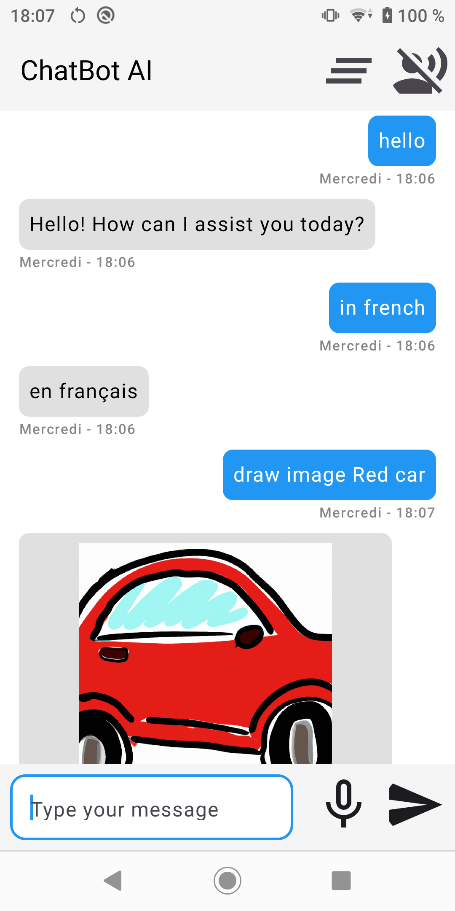

# ChatBot AI Assistant with Open AI

## Get started with the Open API

This repository contains an app demonstrating how to use open ai API, Speech reorganization and textToSpeech

To try out the sample app you can directly import the project from Android Studio

1. Go to https://platform.openai.com/docs/overview
2. Login with your account.
3. Create an API key.  you can use project api keys https://platform.openai.com/api-keys
4. Check out this repository. in utils folder Constants file replace API_KEY
5. Run the app

[Watch the video](Screen_recording_chatbotAI.mp4)

<video width="640" height="480" controls>
  <source src="Screen_recording_chatbotAI.mp4" type="video/mp4">
</video>
